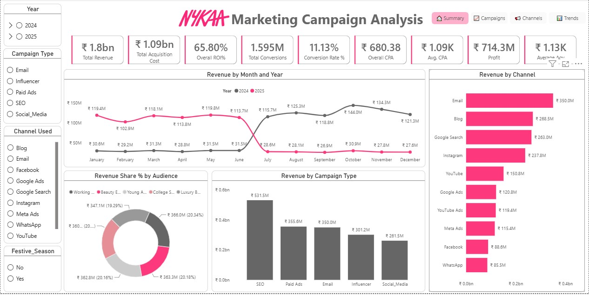
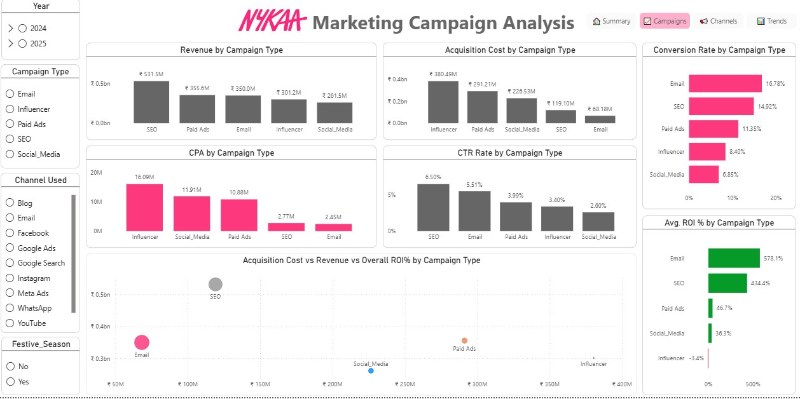

# Nykaa_Marketing_Campaign_Analysis
🎯 Project Objective: The objective of this project is to Analyze Nykaa’s marketing campaign data to evaluate campaign, channel, and audience performance, optimize marketing spend, identify key revenue and ROI drivers, and uncover funnel and seasonal trends using SQL, Python, and Power BI to support data-driven marketing decisions.

Key Objectives
- Analyze campaign performance across different marketing channels.
- Identify high-performing customer segments and campaigns.
- Measure key marketing KPIs such as Revenue, ROI, CTR, CPA, and Conversion Rate.
- Analyze customer funnel performance and seasonal trends.
- Build an interactive Power BI dashboard to support data-driven decision-making.

Summary Report :

Campaign Performance Report :

[See Full Dashboard Here!](https://app.powerbi.com/view?r=eyJrIjoiNTJmM2ZmYWEtNWI3ZS00YmRiLWI1M2QtYzI4M2MzOWYwN2RkIiwidCI6ImRmODY3OWNkLWE4MGUtNDVkOC05OWFjLWM4M2VkN2ZmOTVhMCJ9)
